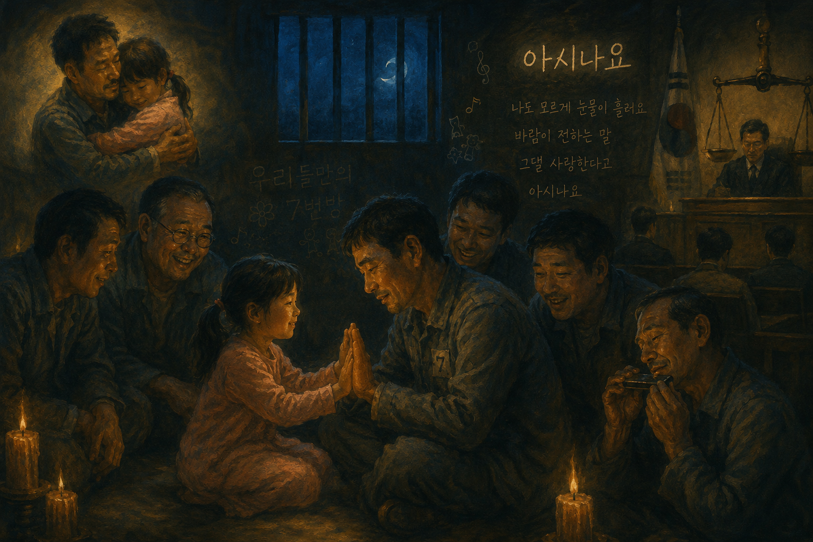

# Miracle in Cell No. 7

The film begins with Yong-gu, a father with an intellectual disability, who is falsely accused of a crime and imprisoned. At first, Cell No. 7 feels cold, hostile, and isolated, but as Yong-gu’s innocence and sincere love for his daughter Ye-seung become apparent, it gradually transforms into a warm and supportive community. In particular, when the inmates come to understand the deep bond between Yong-gu and Ye-seung, the prison changes from a bleak and lifeless place into a family-like space where people comfort and care for one another, creating a deeply moving atmosphere. The film was directed by Lee Hwan-kyung and portrays the values of family love and humanity while criticizing social prejudice and institutional injustice rather than focusing solely on disability itself. During the emotional scenes, the song Do You Know (Asinayo) is used. This ballad, performed by Jo Sung-mo, is known for its emotional melody and expressive vocals. Its slow tempo, gentle vocal tone, and continuous emotional flow help convey the longing and affection shared between Yong-gu and Ye-seung, allowing the audience to empathize more deeply with their relationship. Furthermore, the warm melody and lyrical atmosphere contrast with the cold and restrictive prison setting, emphasizing the emotional bonds that develop among the characters. The inmates initially view Yong-gu as an unfamiliar and uncomfortable presence, but they gradually come to accept him as a person with whom they can laugh, share feelings, and build meaningful connections. In this way, [Do you know](https://youtu.be/12W5qcG2vXw?si=WQk_-XBLWhYBtqwk) is not merely background music that highlights sadness; rather, it encourages the audience to see Yong-gu not as an object of pity or tragedy, but as a human being deserving of understanding and empathy. Jo Sung-mo’s heartfelt vocals and the song’s sentimental ballad style further reinforce the themes of family love, longing, and compassion conveyed throughout the film. In addition, the film raises important questions about justice by depicting the discrimination and unfair treatment that occur throughout Yong-gu’s false accusation and trial. It suggests that social prejudice and institutional injustice can be greater problems than disability itself. Therefore, *Miracle in Cell No. 7* is not simply a touching drama, but also a meaningful work that encourages viewers to reflect on human dignity and social justice. It will be helpful if you refer to [An article about other works](https://github.com/hskye79/medicalhumanitiesmusic-2026-1/blob/main/lee-chanhyeok.md) in this regard.

# 7번방의 선물

영화의 줄거리는 지적장애를 가진 아버지 용구가 억울한 누명을 쓰고 감옥에 수감되면서 시작된다. 처음에는 냉랭하고 폐쇄적으로 느껴지던 7번방은 용구의 순수함과 딸 예승을 향한 진심이 드러나면서 점차 따뜻한 공동체의 공간으로 변화한다. 특히 수감자들이 용구와 예승의 애틋한 관계를 이해하게 되는 순간, 차갑고 삭막했던 감옥은 서로를 위로하고 보듬는 가족 같은 공간으로 바뀌며 깊은 감동을 전한다.이 영화는 이환경 감독이 연출한 작품으로, 장애를 가진 개인의 문제가 아닌 사회적 편견과 제도적 부당함을 비판하며 가족애와 인간애의 가치를 따뜻하게 그려 낸다. 감정적인 장면에서 삽입곡 아시나요가 사용되는데, 이 곡은 가수 조성모의 대표적인 발라드 곡이다. 느린 템포와 부드러운 보컬 음색, 그리고 반복적으로 이어지는 감정선은 용구와 예승이 서로를 그리워하는 마음을 더욱 절절하게 느끼게 하며 관객의 공감을 이끌어낸다. 또한 따뜻한 멜로디와 서정적인 분위기는 차갑고 제한적인 감옥이라는 공간과 대비를 이루어 인물들 사이의 정서적 유대감을 더욱 강조한다. 수감자들 역시 처음에는 용구를 낯설고 불편한 존재로 바라보다가 점차 함께 웃고 공감할 수 있는 한 사람으로 받아들이게 된다. 이처럼  [아시나요](https://youtu.be/12W5qcG2vXw?si=WQk_-XBLWhYBtqwk)는 단순히 슬픔을 강조하는 배경음악이 아니라, 용구를 결핍이나 비극의 대상으로만 보이게 하는 것이 아니라 한 인간으로 공감하게 만드는 중요한 역할을 한다. 특히 조성모 특유의 호소력 짙은 보컬과 서정적인 발라드 스타일은 영화가 전달하고자 하는 가족애와 그리움의 정서를 효과적으로 뒷받침한다. 또한 영화는 억울한 누명과 재판 과정 속 차별적인 시선을 통해 장애 자체보다 사회적 편견과 제도적 부당함이 더 큰 문제일 수 있음을 보여 주며 관객에게 깊은 질문을 던진다. 이러한 점에서 *7번방의 선물*은 단순한 감동 영화가 아니라 인간의 존엄성과 사회적 정의에 대해 생각해 보게 만드는 의미 있는 작품이라고 할 수 있다.이와 관련해서는 비슷한 질병을 다룬 [다른작품에 대한 글](https://github.com/hskye79/medicalhumanitiesmusic-2026-1/blob/main/lee-chanhyeok.md)을 참조하면 도움이 될것이다.

