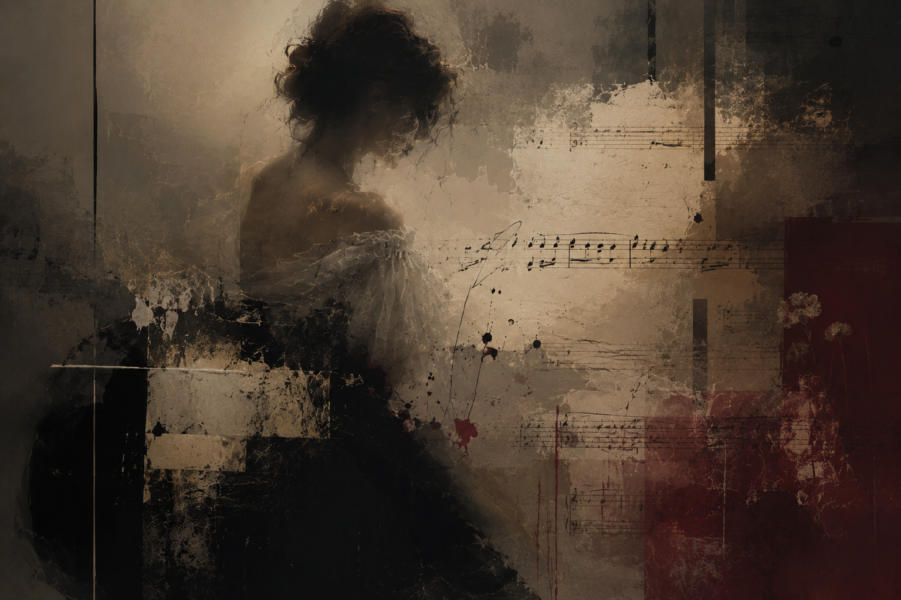

# Opera La Traviata

In *La Traviata*, Verdi represents Violetta’s physical decline through musical “fragmentation”. In Act III, particularly in the aria “Addio del passato,” the melodic lines repeatedly break off before fully developing, evoking the labored breathing and physical exhaustion associated with pulmonary tuberculosis. The weakening vocal delivery and slowing musical flow further reflect Violetta’s fading vitality and gradual disappearance from both society and life itself. This fragmentation demonstrates how the character’s bodily condition directly shapes musical time and structure. Furthermore, it can be understood not only as a representation of physical symptoms but also as an expression of illness as a lived experience, reflecting Violetta’s social isolation and gradual erasure. Thus, in this opera, disease functions not merely as a narrative element but as a central expressive device that reveals the intersection of body, society, and the dissolution of existence through musical form. This aspect can also be connected to [The Diving Bell and the Butterfly, in which “La Mer”](kim-dohyun.md) highlights the gap between an immobilized body and a free consciousness. Both works present illness and disability not merely as loss, but as sensory experiences that reshape human existence.

[Listen to Act III of La Traviata, where Violetta’s physical decline and musical “fragmentation” are expressed](https://www.youtube.com/watch?v=Do4Ei7Cio2g)

# 오페라 <라 트라비아타>

베르디는 비올레타의 신체적 쇠락을 음악적 ‘단절’을 통해 형상화한다. 특히 3막 아리아 「Addio del passato」에서는 선율이 길게 이어지지 못하고 짧게 끊기며 반복되는데, 이러한 구조는 폐결핵 환자의 불안정한 호흡과 쇠약해진 신체 상태를 연상시킨다. 또한 약해지는 성량과 느려지는 흐름은 비올레타가 점차 삶의 의지를 잃어가고 존재가 희미해지는 과정을 드러낸다. 이러한 단절은 단순한 표현 효과를 넘어, 인물의 신체 상태가 음악의 시간성과 구조 자체에 직접 개입하는 방식을 보여준다. 더 나아가 이러한 음악적 단절은 단순한 신체적 증상의 재현을 넘어, 비올레타가 사회적으로 고립되고 점차 존재를 잃어가는 질환 경험을 드러내는 방식으로 이해될 수 있다. 즉, 이 작품에서 질병은 단순한 서사적 장치가 아니라, 음악의 호흡과 밀도를 통해 신체와 사회, 그리고 존재의 소멸을 동시에 드러내는 핵심적인 표현 장치로 기능한다. 이러한 점은 [《잠수종과 나비》의 “La Mer”](kim-dohyun.md)가 움직일 수 없는 신체와 자유로운 의식의 간극을 드러내는 방식과도 연결된다. 두 작품 모두 질병이나 장애를 단순한 결핍이 아니라, 인간 존재를 새롭게 인식하게 만드는 감각적 경험으로 제시한다.

[비올레타의 신체적 쇠락과 음악적 ‘단절’이 드러나는 「La Traviata」 3막 아리아 감상하기](https://www.youtube.com/watch?v=Do4Ei7Cio2g)
