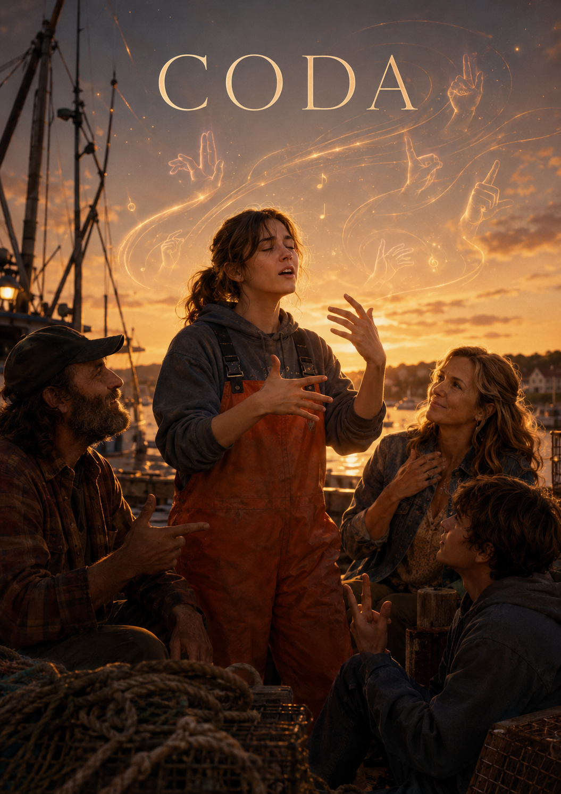

# CODA

In *CODA*, music is not used to portray deafness simply as a lack or deficiency. Instead, the film shows how music can be experienced differently as something that is “heard” and something that is “seen.” In Ruby’s performance scene, the film briefly removes sound, allowing the audience to experience the auditory world of her Deaf family. Later, when Ruby sings [“Both Sides, Now”](https://youtu.be/qlTEAXcKssg?si=MdMA5ux1r6jlhYt0) while also expressing it through sign language, the scene shows that music does not have to be communicated only through the ears. As the title suggests, the song is about looking at the world from more than one side, which connects closely to Ruby’s position between the hearing world and her Deaf family’s world. Its calm and reflective mood, along with its message that life and love cannot be understood from only one perspective, naturally reflects Ruby’s complex emotions as she loves her family but also has to choose her own life. For Ruby, music is not merely a hobby. It is a language of self-realization through which she grows beyond the role of being the family interpreter and discovers her own dream. Although she loves her family, she has always carried the responsibility of speaking on their behalf, which makes it difficult for her to express her own feelings and desires. In this sense, singing becomes a way for Ruby to reveal emotions she could not fully express in words. It also becomes a turning point that helps her realize that her life does not exist only for her family. Ruby’s music also becomes an opportunity for her family to understand her in a new way. Although her Deaf family cannot directly hear her singing, they come to feel how deeply she loves music through her facial expressions, gestures, sign language, and the emotions she reveals on stage. In particular, the scene in which her father places his hand on Ruby’s throat and feels the vibration of her singing clearly shows that music does not exist only as sound. In this moment, music is not heard through the ears but sensed through the body, and Ruby’s emotions are conveyed to her family through vibration and touch. Through this process, music reveals the distance between Ruby and her family, while also becoming a medium that allows them to understand one another more deeply. Therefore, *CODA* does not place deafness on the opposite side of music. Rather, it shows that music can be translated again through the body, gaze, vibration, and relationships. The “Both Sides, Now” scene presents this moment of translation visually and sensuously through sign language, facial expressions, and bodily movement, revealing how people who experience the world in different ways can reconnect through music. Meanwhile, if you would like to read about [another work that deals with hearing impairment](ra-haeri.md), you may find this helpful.

 

 # 코다

*CODA*에서 음악은 청각장애를 결핍으로만 묘사하지 않고, ‘듣는 음악’과 ‘보는 음악’이 어떻게 다르게 경험될 수 있는지를 보여준다. 특히 루비의 공연 장면에서 영화는 한순간 소리를 지워 농인 가족의 청각적 세계를 관객이 체험하게 하고, 이후 루비가 [〈Both Sides, Now〉](https://youtu.be/qlTEAXcKssg?si=MdMA5ux1r6jlhYt0)를 부르며 동시에 수어로 표현하는 장면을 통해 음악이 반드시 귀로만 전달되는 것은 아님을 보여준다. 이 노래는 제목처럼 서로 다른 두 세계를 동시에 바라보는 곡이며, 영화 속에서는 청인 세계와 농인 가족의 세계 사이에 놓인 루비의 위치와도 맞물린다. 또한 차분하고 회고적인 분위기의 노래는 삶과 사랑을 한쪽에서만 바라볼 수 없다는 메시지를 담고 있어, 가족을 사랑하면서도 자신의 삶을 선택해야 하는 루비의 복합적인 감정과 자연스럽게 연결된다. 루비에게 음악은 단순한 취미가 아니라, 가족 안에서 통역자 역할에 묶여 있던 자신이 독립적인 존재로 성장하고 자신의 꿈을 발견하는 자아실현의 언어이다. 그녀는 가족을 사랑하지만, 동시에 늘 가족의 목소리를 대신해야 한다는 책임감 속에서 자신의 감정과 욕망을 쉽게 말하지 못한다. 그래서 노래는 루비가 말로 다 표현하지 못했던 마음을 드러내는 방식이자, 자신의 삶이 가족만을 위해 존재하는 것이 아니라는 사실을 깨닫게 하는 계기가 된다. 또한 루비의 음악은 가족에게도 새로운 이해의 계기가 된다. 농인 가족은 노래를 직접 들을 수는 없지만, 루비의 표정, 몸짓, 수어, 그리고 무대 위에서 드러나는 감정을 통해 딸이 음악을 얼마나 사랑하는지 느끼게 된다. 특히 아버지가 루비의 목에 손을 대고 노래의 진동을 느끼는 장면은 음악이 소리로만 존재하지 않는다는 점을 잘 보여준다. 이 장면에서 음악은 귀로 듣는 것이 아니라 몸으로 감각되고, 루비의 감정은 진동과 접촉을 통해 가족에게 전달된다. 이 과정에서 음악은 루비와 가족 사이의 거리감을 드러내는 동시에, 서로를 더 깊이 이해하게 만드는 매개가 된다. 그래서 CODA는 청각장애를 음악의 반대편에 놓기보다, 음악이 몸·시선·진동·관계 속에서 다시 번역될 수 있음을 보여주는 작품이라고 할 수 있다. 〈Both Sides, Now〉 장면은 바로 그 번역의 순간을 수어와 표정, 몸짓을 통해 시각적이고 감각적으로 보여주며, 서로 다른 방식으로 세계를 경험하는 사람들이 음악을 통해 다시 연결될 수 있음을 드러낸다. 한편, [청각장애를 다룬 또다른 작품](ra-haeri.md)에 대한 글을 읽고 싶다면 참고하길 바란다.
