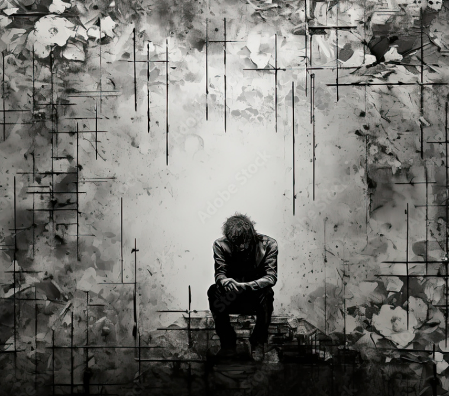

# Symphony NO.14

Dmitri Shostakovich (1906–1975) was a Russian composer known for exploring themes of suffering and death. His *Symphony No.14* (1969) is a vocal symphony that sets poems by various writers to music.
[In one of the Music’s most memorable scenes](https://www.youtube.com/watch?v=bAzZcKB6LO8), the 10th movement, "The Death of the Poet," where sharp string melodies and ominous percussion strikes combine to express human mortality and despair in the most powerful and agonizing way.The work directly portrays death, suffering, and human vulnerability, including situations caused by illness, violence, and oppression. It does not treat death abstractly but presents it as a real and painful human experience, making it highly relevant to medical humanities. Here, the unconventional orchestration, stripped of winds and brass, along with the harsh, unresolved dissonances, functions as a powerful non-verbal narrative. These acoustic choices vividly evoke not just psychological depression, but the visceral trauma, physical agony, and bodily collapse induced by systemic violence and institutional oppression. The sparse, dark orchestral textures combined with the raw, piercing vocal expressions create an overwhelming atmosphere of tension and despair. In this regard, referring to [other musical content](kim-chaeeun.md) will also be helpful.          

# 심포니 14번

드미트리 쇼스타코비치(Dmitri Shostakovich, 1906–1975)는 20세기 러시아 작곡가로, 인간의 고통과 죽음을 깊이 있게 다룬 작품을 많이 남겼다. 그의 교향곡 14번은 소프라노와 베이스가 참여하는 성악 교향곡으로, 다양한 시인의 시를 가사로 사용하여 죽음과 고통, 질병으로 인한 인간의 한계를 직접적으로 표현한다. [음악에서 가장 인상적인 장면](https://www.youtube.com/watch?v=bAzZcKB6LO8)은 죽음의 그림자가 극에 달하는 제10악장 '시인의 죽음'으로, 날카로운 현악기 선율과 타악기의 불길한 타격음이 결합되어 인간의 유한함과 절망을 가장 강렬하고도 처절하게 표현해낸 부분이다.이 작품은 단순히 죽음을 철학적으로 다루는 것이 아니라, 전쟁, 질병, 폭력 등으로 인해 실제로 죽음에 이르는 상황을 매우 현실적으로 묘사한다. 따라서 이 작품은 질병과 고통을 명확하게 드러내는 20세기 대표 음악이다. 특히 관악기를 완전히 배제한 채 현악기와 타악기만으로 이루어진 변칙적인 악기 편성과 해결되지 않는 날카로운 불협화음은 그 자체로 강력한 비언어적 서사 역할을 한다. 이러한 음향적 요소들은 청중으로 하여금 단순한 정신적 우울감을 넘어, 억압과 폭력에 의해 무너져 내리는 신체적 외상과 복합적인 질병의 고통까지 직관적으로 체감하게 만든다. 어둡고 절제된 관현악의 음색과 날카롭고 처절한 목소리의 표현 방식이 결합되어 압도적인 긴장감과 절망적인 분위기를 자아낸다. 이와 관련해서는 [다른 음악의 내용](kim-chaeeun.md)도 참조하면 도움이 될 것이다.
