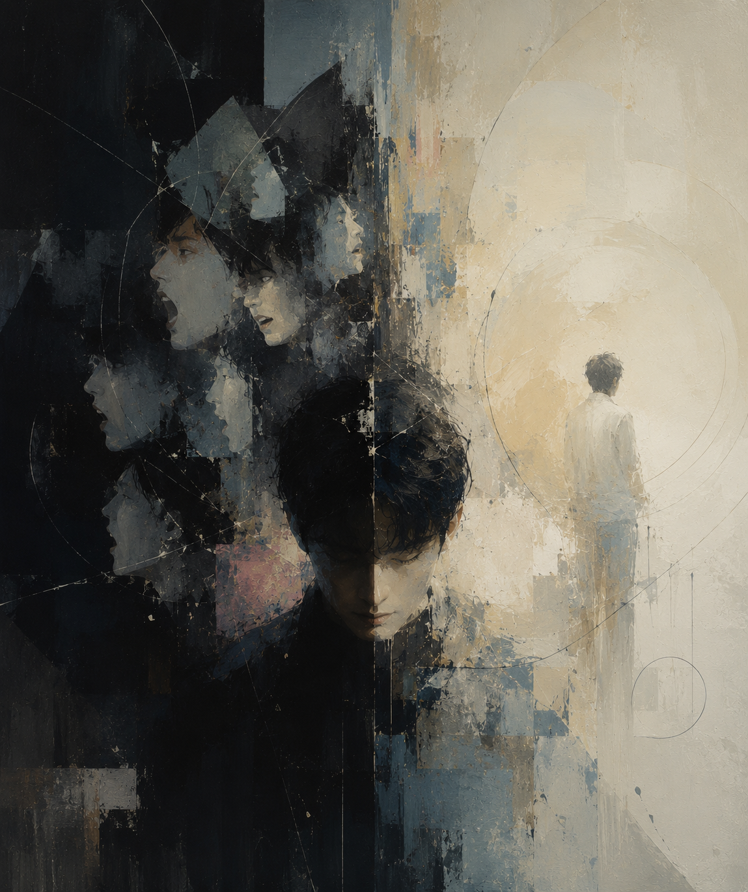

# Kill Me, Heal Me

The drama [*Kill Me, Heal Me*](https://youtu.be/tVoE9_eN8TE?si=w_Rq8E_I_wrP-ogM)tells the story of the protagonist, Cha Do-hyun, a patient with Dissociative Identity Disorder (DID) whose mind has fractured into seven distinct personalities due to the trauma of a horrific childhood experience. The song “Auditory Hallucination” by Jang Jae-in, featured as an OST in this work, effectively portrays the protagonist's fragmented ego, helping viewers better understand it. In particular, through the musical contrast between two opposing voices, this track multidimensionally illustrates the hostility between the personalities clashing within the patient's mind. The fast and aggressive rhythm of the rap represents the destructive personality "Shin Se-gi," who seeks to suppress and control the original personality. The rap lyrics, "The things hidden inside me have changed me a lot," coupled with a low and rough vocal tone, starkly reveal the violence and dark side of the Shin Se-gi personality. On the other hand, the subsequent vocal part creates a stark contrast with its lyrical melody and sorrowful tone. The sung lyrics, "I want to escape from the pain tightening around me, somebody take me out," showcase the desperate emotions of the original personality, "Cha Do-hyun," who yearns to break free from his fragmented memories and be saved. These opposing voices and lyrics serve as a musical device that vividly demonstrates the conflict between the personalities. Ultimately, this stark contrast in tone, rhythm, and lyrics translates the agonizing pain of the patient—which is often difficult to convey to others using everyday language—into a sensory experience that is easy for listeners to understand. Furthermore, by intertwining the two contrasting voices, it does more than just deeply reveal the characteristics of the disorder, such as the constant emotional confusion Cha Do-hyun experiences; it also allows the audience to immerse themselves and empathize with the imminent threats, desperate circumstances, and profound emotions he faces. In this context, it would also be helpful to refer to the musical [*Jekyll & Hyde*](ham-yeji.md), as it provides an excellent point of comparison for how music can express the internal conflicts experienced by the fragmented egos of patients with Dissociative Identity Disorder.

# 킬미, 힐미

드라마 [《킬미,힐미(Kill Me, Heal Me)》](https://youtu.be/tVoE9_eN8TE?si=w_Rq8E_I_wrP-ogM)는 어렸을 적 끔직한 경험으로 트라우마를 겪어 일곱 개의 인격으로 분열된 해리성 정체성 장애 환자인 주인공 차도현의 이야기를 다룬 작품이다. 이 작품에 삽입된 ost인 장재인의 ‘환청’이라는 노래는 해당 드라마의 주인공이 겪는 자아 분열을 시청자로 하여금 더 잘 이해할 수 있도록 효과적으로 표현한다. 특히 이 곡은 상반된 두 목소리의 음악적 대립 구조를 통해, 해당 질병을 겪는 주인공의 내면에서 벌어지는 인격 간의 적대성을 입체적으로 보여준다. 빠르고 공격적인 리듬의 랩은 본래 인격인 ‘차도현’을 억누르고 통제하려는 파괴적인 ‘신세기’라는 인격을 대변한다. “내 안에 숨은 것들이 날 참 많이 변하게 했잖아”라는 랩 가사는 낮고 거친 음색과 맞물려 신세라는 인격이 가진 폭력성과 이면을 적나라하게 나타낸다. 반면, 이어지는 보컬 파트는 서정적인 멜로디와 애절한 음색으로 대조를 이룬다. “벗어나고 싶어 날 옥죄는 고통에서 누가 나를 꺼내줘”라는 보컬의 노래 가사는 조각난 기억 속에서 벗어나 구원받고 싶어 하는 본래 인격인 차도현의 절박한 감정을 보여준다. 이처럼 상반된 두 목소리와 가사는 인격의 대립을 잘 보여주는 음악적 장치이다. 결과적으로 이러한 음색과 리듬, 가사의 극명한 대비는 우리가 흔히 사용하는 언어로는 타인에게 전달되기 어려운 환자가 가진 고통을 듣는 이로 하여금 이해하기 쉽게 감각적으로 표현한다. 또한 상반되는 두 목소리의 교차를 통해 주인공인 차도현이 매 순간 겪는 혼란과 같은 감정처럼 해당 장애가 가진 특성을 깊이 있게 드러내는 것에 그치지 않고 보는 사람으로 하여금 차도현이 겪는 위협과 절박한 상황, 그리고 감정에 이입할 수 있게 한다. 이와 관련해서 음악이 해리성 정체성 장애 환자의 분열된 자아가 겪는 대립을 어떻게 표현해내는지 비교해볼 수 있다는 면에서 뮤지컬 [《지킬 앤 하이드》](ham-yeji.md)도 참조하면 도움이 될 것이다.
