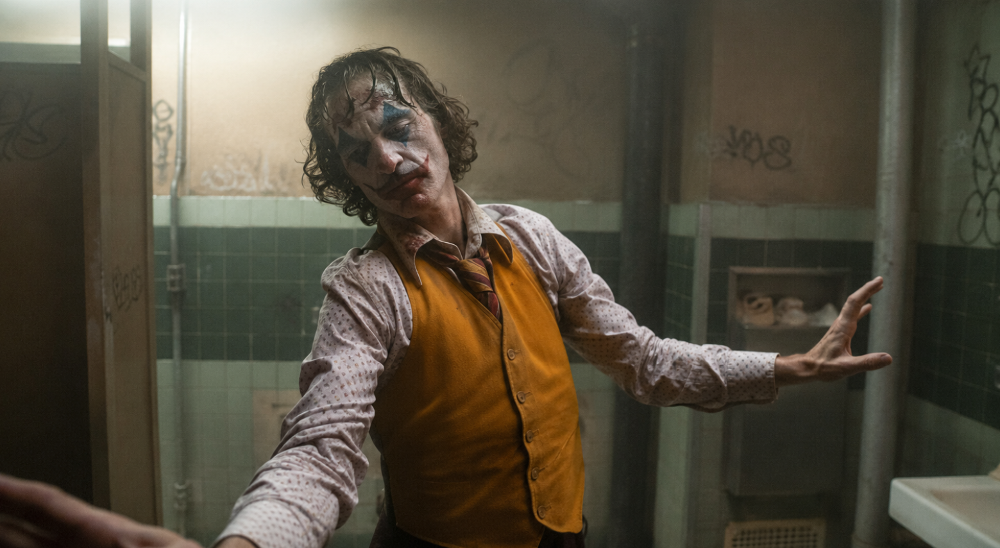

# Joker

The film Joker portrays the life of Arthur Fleck, a socially isolated individual suffering from mental illness, and depicts his gradual psychological breakdown as he transforms into the persona of “Joker.” The representative music used in the film is Bathroom Dance, composed by Hildur Guðnadóttir (1982– ), which has no lyrics and is characterized by low-pitched cello melodies, slow and repetitive rhythms. This music is used in scenes such as when Arthur dances in the bathroom after committing a murder, effectively expressing his suppressed emotions, anxiety, and inner collapse. The heavy and dark musical atmosphere emphasizes his mental instability and sense of isolation, allowing the audience to experience his psychological tension, and functions as a crucial device that conveys the internal experience of mental illness beyond a simple background score. This work can be read alongside [@taehyeon533's analysis of *Extraordinary Attorney Woo*](taehyeon533.md), which examines how music represents the unique perception and inner world of a character with autism spectrum disorder. It is also related to [@MoonSoohyun2's discussion of *Next to Normal*](moon-soohyun.md), which explores the emotional instability and treatment dilemmas associated with bipolar disorder. In addition, [@ohhwaeun's analysis of *Page Turner*](oh-hwaeun.md) similarly shows how music helps individuals confront disability and reconstruct their identities after psychological and physical loss.

# 조커

Music/Video: Bathroom Dance (Joker Original Motion Picture Soundtrack)
YouTube: https://youtu.be/zAGVQLHvwOY

영화 Joker는 사회적 고립과 정신질환을 겪는 아서 플렉이 점차 현실과 환상을 구분하지 못하고 ‘조커’라는 자아로 변모하는 과정을 그린 작품이다. 작품에 사용된 대표 음악은 Hildur Guðnadóttir(1982– )가 작곡한 Bathroom Dance로, 가사는 없으며 저음 중심의 첼로 선율과 느리고 반복적인 리듬이 특징이다. 이 음악은 아서가 살인을 저지른 뒤 화장실에서 춤추는 장면 등에서 사용되며, 그의 억눌린 감정과 불안, 내면 붕괴를 직접적으로 드러낸다. 음악의 무겁고 어두운 분위기는 아서의 정신질환과 고립감을 강조하며, 관객이 그의 심리적 불안정성을 체감하도록 만드는 중요한 표현 장치로 기능한다. 이 글은 자폐 스펙트럼 장애를 지닌 인물의 독특한 인지 방식과 내면 세계를 음악적으로 분석한 [@taehyeon533의 「이상한 변호사 우영우」](taehyeon533.md)와 관련이 있다. 또한 양극성 장애 환자의 감정 변화와 치료의 딜레마를 다룬 [@MoonSoohyun2의 「넥스트 투 노멀」](moon-soohyun.md)과도 연결된다. 더불어 장애와 상실 이후 음악을 통해 새로운 정체성을 형성하는 과정을 설명한 [@ohhwaeun의 「페이지 터너」](oh-hwaeun.md) 역시 질병과 장애가 개인의 삶과 자아를 변화시키는 과정을 다룬다는 점에서 공통점을 가진다.
