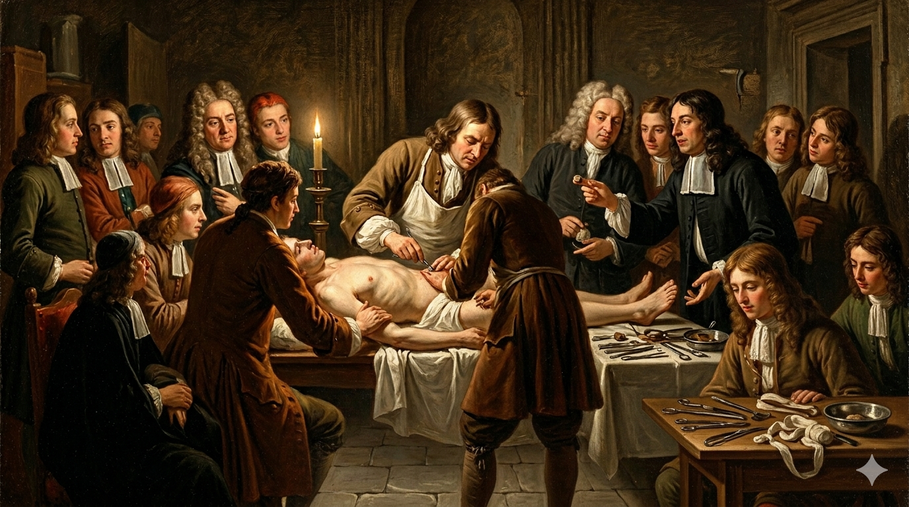

# Le Tableau de l'Opération de la Taille

Played on viola da gamba and harpsichord, **[the score of Marin Marais(1656-1728)](https://www.youtube.com/watch?v=1VUcXjn9ib8)** depicts the composer's own experience of bladder stone surgery in his 60s, guided by a narrator’s chronological annotations alongside the surgery procedure(e.g. The utterance of "_Icy se fait l’incision_." by the narrator, which means "Here the incision is made." when the notes become sharper). The music begins with a somber E minor and slow tempo to capture the patient's fear and tension, then vividly reanimates the agonizing surgical process—from incision to extraction—through sharp, high-pitched dissonances. The latter half of the music, which is also referred to as 'Les Relevailles', then shifts into a bright E major, depicting the successful operation and the patient's relief. It clearly shows that the patient is comforted by the liberation from the acute surgical pain and the mere fact of surviving it, which dramatically reflects the grim medical situation of the era without proper anesthetic procedures and hygiene standards.

Although it is written a century after the prior piece, I also recommend that you listen to **[the third movement of Beethoven’s String Quartet No. 15 (Op. 132)](https://www.youtube.com/watch?v=gumi5pEpOaA)**. Apart from his well-known hearing loss, Beethoven wrote this work to thank God for his 'new life' after surviving a severe intestinal illness in his later years. Both pieces share a quite similar atmosphere in capturing the memory of relief on overcoming intense physical suffering. If you are also interested in Beethoven's songs about his hearing impairment, I recommend you to find more about **[his piano sonata No.29](seo-yonghwan.md)**.

# 절제수술대

비올라 다 감바와 하프시코드로 연주되는 **[마랭 마레(1656-1728)의 해당 작품은](https://www.youtube.com/watch?v=1VUcXjn9ib8)** 작곡가가 60대에 직접 경험한 방광결석 제거 수술을 묘사한 작품으로, 시간 순서에 맞춰 수술의 진행을 안내하는 사회자의 주석(e.g. 음률이 날카로워지는 구간이 오자 "이 순간 절개가 이뤄집니다"라는 뜻의 "_Icy se fait l’incision_"라고 사회자가 직접 발언함)이 음악과 함께 등장합니다. 음악의 전반부는 수술대에 오르며 환자가 경험하는 공포와 긴장 등의 감정을 반영해 엄숙한 E단조와 느린 템포로 시작되고, 이어 환부가 절개되고 결석이 꺼내어지기까지의 고통스러운 수술 과정은 날카롭고 높은 음들의 불협화음으로 재현됩니다. 이후 '회복'이라고도 불리는 후반부 구간은 분위기가 보다 밝은 E장조로 전환되면서 수술의 성공적 완수와 그에 따른 환자의 안도감을 보여주고 있습니다. 해당 음악은 환자가 느끼는 극심한 고통, 그리고 치료 여부를 떠나 수술이 끝났다는 사실 자체에 안도하는 모습을 그려내고 있는데, 이는 마취와 위생 관념이 미비하여 수술 과정의 고통이 극에 달하고 생존율마저 낮았던 당대의 열악한 의료 현실을 극적으로 투영하고 있습니다.

비록 위 작품으로부터 한 세기 이후의 곡이긴 하지만 **[베토벤의 현악 사중주 15번(Op. 132) 3악장도](https://www.youtube.com/watch?v=gumi5pEpOaA)** 함께 감상해 보길 추천드립니다. 세간에 잘 알려진 베토벤의 청각 상실과는 별개로, 그는 말년에 극심한 장 질환을 극복한 후 '새로 얻은 삶'에 있어 신께 감사하는 마음을 보이고자 이 악장을 작곡했습니다. 두 작품 모두 신체적 고통을 극복한 후 경험한 안도감에 대해 이야기한다는 점에서 감정적 결이 상당히 닮아 있다고 생각합니다. 이 외에도 베토벤이 그의 청각장애에 관해 작곡한 곡들이 궁금하다면 **[그의 피아노 소나타 29번에](seo-yonghwan.md)** 대해 알아보는 것도 추천드립니다.
