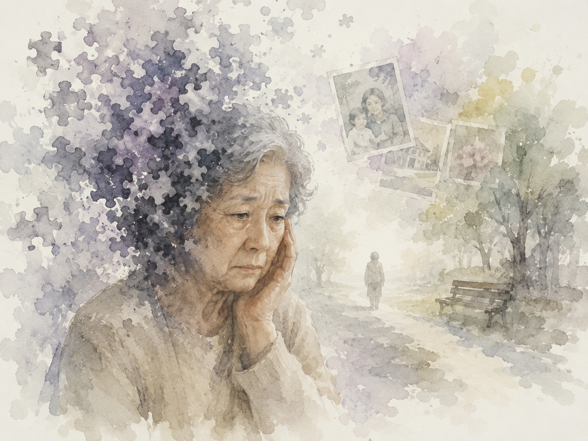

# Dear my freinds

The drama Dear My Friends (2016) begins as 'Hee-ja,' an elderly protagonist who is left alone after living her entire life for her husband and children, faces the harsh reality of Alzheimer's disease. Amidst the terror of delusions and memory loss, rather than isolating herself, Hee-ja chooses to solidarity with her lifelong friends. By willingly entering a nursing home to avoid becoming a burden to her children, she preserves her human dignity until the very last moments of her life. This desperate yet beautiful journey intimately connects the patient's inner world with the audience beyond the screen through "[Want to Be Free](https://youtu.be/MJym9hB74C8?si=8sfheuB3x9ev1BPF)," an OST track co-created by composer Henry.

Layering a dreamlike synthesizer sound and ethereal humming over a serene piano melody, this track sensibly recreates the sensory dissonance between reality and the patient’s blurred, fragmenting consciousness. In particular, the rough string orchestration and the sharp timbre of the violin, which intensify toward the latter half, chillingly pierce through the profound fear Hee-ja experiences amidst her cognitive alienation.

Combined with these musical devices, the poignant lyrics—"Even if I lose myself, please remember me"—exert a powerful resonance. Rather than viewing the disease as a mere physical and mental regression, the music serves as a core psychological mechanism that auditorily shapes the instinctive yearning for freedom and human agency that refuses to vanish, even within a crumbling self, leaving a profound and lingering impression.

# 디어마이프렌즈

드라마 <디어 마이 프렌즈>(2016)는 평생을 자식과 남편을 위해 살다 홀로 남은 노년의 주인공 '희자'가 알츠하이머병이라는 가혹한 현실을 마주하며 시작된다. 망상과 기억 상실의 공포 속에서 희자는 홀로 고립되기보다 평생을 함께한 친구들과 연대하고, 자식에게 짐이 되지 않기 위해 스스로 요양원행을 선택하는 등 삶의 마지막 순간까지 인간으로서의 존엄성을 지켜나간다. 이 절박하고도 아름다운 여정은 작곡가 헨리 등이 참여한 OST ['Want to Be Free'](https://youtu.be/MJym9hB74C8?si=8sfheuB3x9ev1BPF)를 통해 환자의 내면과 스크린 밖의 관객을 단단하게 연결한다.

이 곡은 잔잔한 피아노 선율 위로 몽환적인 신시사이저 사운드와 허밍을 얹어, 기억이 파편화되는 환자의 혼란스러운 의식과 현실 간의 이질감을 감각적으로 재현한다. 특히 후반부로 갈수록 고조되는 현악기의 거친 연주과 날카로운 바이올린 음색은 인지적 소외 속에서 희자가 느끼는 극심한 두려움을 서늘하게 파고든다.

"내가 나를 잃어가도 나를 기억해달라"는 애절한 가사는 이 음악적 장치들과 결합하여 강력한 힘을 발휘한다. 음악은 질병을 단순한 신체적·정신적 퇴행으로 보지 않고, 무너져가는 자아 속에서도 끝내 소멸하지 않는 인간의 주체성과 자유에 대한 본능적 갈망을 청각적으로 형상화하는 핵심적인 심리적 기제로 기능하며 깊은 여운을 남긴다.
